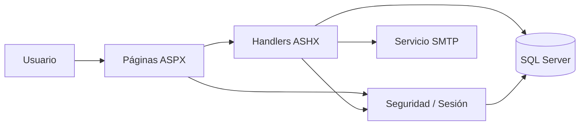
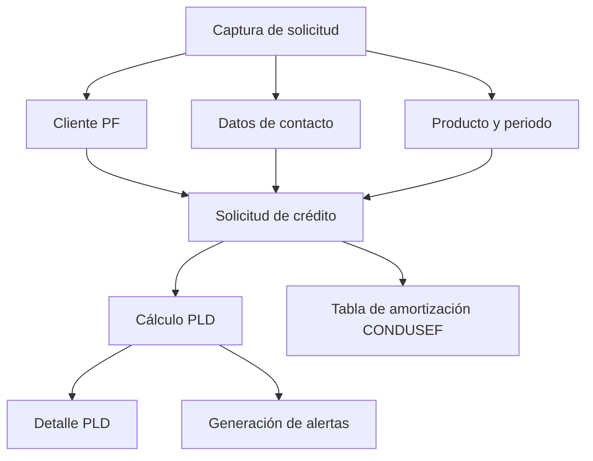

# PLD

Sistema web para operación de **Prevención de Lavado de Dinero (PLD)** y procesos relacionados con **originación/administración de crédito**, construido con ASP.NET Web Forms y VB.NET.

> [!IMPORTANT]
> ## Instrucciones obligatorias para humanos, ChatGPT y Codex
> Antes de analizar, modificar, crear o eliminar cualquier archivo de este repositorio se debe leer **completo** `AGENTS.md`.  
> `AGENTS.md` es la **única fuente de instrucciones permanentes del proyecto**. Las solicitudes concretas para Codex se documentan en `cambios_codex/` y todo cambio terminado debe registrarse en `BITACORA_CAMBIOS.md`.


> Este repositorio contiene software operativo y reglas configurables. Su existencia o funcionamiento técnico **no implica por sí mismo cumplimiento regulatorio**. Umbrales, criterios de riesgo, reportes y reglas PLD deben validarse contra la normativa vigente aplicable, el manual de cumplimiento de la institución y las políticas internas antes de usarse en producción.

## Estado técnico

- ASP.NET Web Forms
- VB.NET
- .NET Framework **4.5.2**
- Solución de Visual Studio formato 12 / metadatos de **Visual Studio 2015**
- SQL Server mediante `System.Data.SqlClient`
- IIS Express para desarrollo
- Autenticación por Forms Authentication
- Front-end basado en páginas `.aspx`, JavaScript y handlers `.ashx`
- Rama principal: `main`

El proyecto tiene actualmente alrededor de **290 archivos** dentro de `PLD/`, incluyendo 43 páginas ASPX, 62 handlers ASHX y 157 archivos VB.

---

## Objetivo funcional

La aplicación concentra funciones de PLD, captura de clientes y solicitudes de crédito, administración de productos financieros, pagos, scoring/configuración de riesgo, catálogos operativos y seguridad por roles.

Los módulos principales identificados en el código son:

| Módulo | Función principal |
| --- | --- |
| Solicitud de crédito | Alta, consulta, actualización, relaciones, finalización y cálculo de amortización |
| Clientes PF | Alta, actualización, búsqueda y consulta de persona física |
| Contacto | Teléfonos, correos y domicilios ligados a la solicitud |
| Evaluación PLD | Precarga de factores, cálculo, guardado y detalle de resultado |
| Alertas PLD | Reglas, bandeja, asignación, bitácora, generación manual y automática |
| Pagos de crédito | Consulta, aplicación, referencias y cancelación; saldo revolvente derivado cuando aplica |
| Crédito revolvente | Configuración de línea, disposiciones, saldo utilizado, disponible e historial operativo |
| Productos financieros | Catálogo, detalle, periodos y parámetros del producto |
| Clasificación / scoring | Puntajes, pesos y configuración por categorías |
| Catálogos | Países, estados, municipios, nacionalidades, ocupaciones, origen/destino de recursos, moneda, canal de pago, etc. |
| Seguridad | Usuarios, roles, puestos, páginas, menú y permisos de acceso |
| Correo PLD | Notificaciones SMTP configurables |

---

## Arquitectura

La aplicación sigue una arquitectura Web Forms tradicional:



### Capas observadas

- **UI**: `PLD/Secure/*.aspx` y páginas públicas de autenticación.
- **Backend HTTP**: `PLD/Handlers/*.ashx.vb`.
- **Seguridad**: `PLD/Security/*.vb`.
- **Servicios**: `PLD/Services/*.vb`.
- **Persistencia**: SQL ejecutado directamente desde handlers y clases de seguridad.
- **Migraciones incrementales disponibles**: `PLD/SQL/*.sql`.

No existe una capa ORM dominante en los módulos revisados: aunque el proyecto referencia Entity Framework 5, la lógica actual usa principalmente `SqlConnection`, `SqlCommand` y SQL parametrizado.

---

## Estructura del repositorio

```text
PLD.sln
AGENTS.md
BITACORA_CAMBIOS.md
cambios_codex/
PLD/
├── App_Data/
├── Docs md/
├── Handlers/
├── My Project/
├── SQL/
├── Secure/
├── Security/
├── Services/
├── assets/
├── Global.asax
├── Login.aspx
├── Logout.aspx
├── CambiarPassword.aspx
├── NoAutorizado.aspx
├── Site.Master
├── PLD.vbproj
├── packages.config
├── Web.Debug.config
└── Web.Release.config
```

### Directorios relevantes

- `Secure/`: pantallas autenticadas.
- `Handlers/`: endpoints HTTP utilizados por las pantallas.
- `Security/`: autenticación, autorización, menú, hashing y sesión.
- `Services/`: servicios compartidos; actualmente incluye correo PLD.
- `SQL/`: scripts incrementales de base de datos y `ESTRUCTURA_BASE_DATOS.md`, que debe mantenerse sincronizado con cualquier cambio de esquema.
- `Docs md/`: documentación funcional/técnica específica.
- `assets/`: CSS, JavaScript, iconos y recursos gráficos.

---

## Flujo principal de solicitud de crédito + PLD

La pantalla `Secure/captura_solicitud_credito.aspx` integra varios componentes:



Handlers utilizados directamente por esta pantalla:

- `solicitud_credito_handler.ashx`
- `catalogos_handler.ashx`
- `contacto_solicitud_handler.ashx`
- `pld_detalle_handler.ashx`
- `clientes_handler.ashx`
- `handler_alertas_pld.ashx`
- `calcular_pld.ashx`

---

## Endpoints principales

Los handlers reciben una acción por request y devuelven datos/JSON según el caso.

| Handler | Acciones principales identificadas |
| --- | --- |
| `calcular_pld.ashx` | `preload`, `calcular`, `guardar` |
| `solicitud_credito_handler.ashx` | `crear`, `obtener`, `actualizar_operacion`, `actualizar_relaciones`, `listar`, `finalizar`, `amortizacion_condusef`, `periodos_producto`, `ping` |
| `clientes_handler.ashx` | `crear`, `actualizar`, `buscar`, `obtener`, `ping` |
| `contacto_solicitud_handler.ashx` | crear/obtener contacto; altas y actualización de teléfonos, correos y domicilios; selección de principal y activación/desactivación |
| `handler_alertas_pld.ashx` | catálogos de reglas/motivos/categorías, bandeja, obtener, bitácora, generación manual/automática, cambio de estatus y asignación |
| `handler_pagos_credito.ashx` | `consultar`, `obtener`, `catalogos`, `buscar_referencias`, `guardar_aplicar`, `cancelar` |
| `handler_credito_revolvente.ashx` | `resumen`, `configurar_linea`, `listar_disposiciones`, `crear_disposicion`, `reversar_disposicion`, `historial` |
| `producto_financiero_handler.ashx` | `list`, `get`, `create`, `update`, `delete` y administración de periodos |
| `seguridad_handler.ashx` | login, cambio de contraseña, usuarios, roles, puestos, páginas, menú y permisos |
| `catalogos_handler.ashx` | catálogos compartidos para captura y operación |
| `pld_detalle_handler.ashx` | `listar`, `resumen`, `ping` |

Además existen handlers específicos para scoring, pesos, catálogos, SEPOMEX, fondeadores, monedas, tasas, instrumentos monetarios y otros parámetros.

---

## Motor y configuración PLD

El cálculo principal se encuentra en:

`PLD/Handlers/calcular_pld.ashx.vb`

Acciones principales:

1. `preload`
2. `calcular`
3. `guardar`

Entre los objetos consultados por el cálculo están:

- `solicitud_credito`
- `vw_pld_factores`
- `catalogo_paises`
- `config_puntaje_categoria`
- `solicitud_pld_detalle`

El proyecto también expone configuración mediante tablas/handlers como:

- `config_umbrales_pld`
- `config_peso_cliente_pf`
- `config_peso_cliente_pm`
- `config_peso_producto`
- `config_peso_zona`
- `config_peso_general`
- `config_peso_alertas`
- `config_peso_transacciones`

**Importante:** las ponderaciones, niveles, umbrales y reglas deben mantenerse como parámetros auditables y reproducibles. Antes de modificar valores productivos deben validarse contra la metodología PLD vigente de la institución.

---

## Alertas PLD

El módulo principal está en:

- UI: `Secure/alertas_pld.aspx`
- Backend: `Handlers/handler_alertas_pld.ashx.vb`

El backend implementa:

- Catálogo de categorías, motivos y reglas.
- Bandeja de alertas.
- Consulta de detalle.
- Bitácora.
- Generación manual.
- Generación desde solicitud.
- Generación desde pagos y agregados de pago.
- Cambio de estatus.
- Asignación.

Objetos relevantes:

- `alertas_pld`
- `alertas_pld_bitacora`
- `catalogo_alerta_categoria`
- `catalogo_alerta_motivo`
- `catalogo_alerta_regla`
- vistas `vw_pagos_credito_pld*`

Una alerta debe tratarse como una condición de revisión; no equivale por sí sola a una determinación de lavado de dinero ni a un rechazo crediticio.

---

## Pagos de crédito

- UI: `Secure/pagos_credito.aspx`
- Backend: `Handlers/handler_pagos_credito.ashx.vb`

Objetos principales identificados:

- `pagos_credito`
- `referencias`
- `solicitud_credito`
- `cliente_persona_fisica`
- `catalogo_aplicacion_pago`
- `catalogo_canal_pago`
- `catalogo_moneda_divisa`
- `catalogo_tipo_pago`
- `vw_pagos_credito_pld`

---

## Crédito revolvente

El crédito revolvente reutiliza `solicitud_credito` como cabecera de la línea y `pagos_credito` para los abonos. Los tipos de crédito se marcan mediante `catalogo_creditos.es_revolvente`.

Objetos incorporados por `PLD/SQL/20260922_001_credito_revolvente.sql`:

- `solicitud_credito.monto_autorizado`
- `solicitud_credito.fecha_vigencia_inicio`
- `solicitud_credito.fecha_vigencia_fin`
- `credito_disposiciones`
- `vw_credito_revolvente_saldo`

El saldo utilizado se deriva como `SUM(disposiciones aplicadas) - SUM(capital de pagos aplicados)`; el disponible es `monto_autorizado - saldo_utilizado`. La pantalla operativa es `Secure/credito_revolvente.aspx`.

La captura de solicitud identifica explícitamente los productos revolventes. Para ellos, `monto_solicitado` conserva el significado de línea solicitada y la tabla fija de amortización CONDUSEF se bloquea tanto en frontend como en backend. La configuración de límite/vigencia y las disposiciones solo se habilitan cuando la solicitud está `FINALIZADA`.

La navegación operativa queda conectada entre Consulta PF → Crédito Revolvente → Pagos, manteniendo separado el comportamiento de crédito simple.

La implementación actual no calcula intereses, pago mínimo, prelación de pagos, mora ni estado de cuenta contractual/regulatorio; esas reglas permanecen pendientes de definición funcional.

---

## Tabla de amortización CONDUSEF

La solicitud de crédito incluye la acción:

`solicitud_credito_handler.ashx?accion=amortizacion_condusef`

La especificación funcional se encuentra en:

`PLD/Docs md/pasos_codex_amortizacion_condusef.md`

El documento define, entre otros puntos:

- Periodicidad Semanal / Quincenal / Mensual tomada del periodo del producto.
- Amortización por saldos insolutos.
- Comisión de apertura como cargo Día 0, no amortizada.
- IVA de la comisión de apertura.
- Exclusión de comisión de gestión de la tabla CONDUSEF.
- Estructura y orden de columnas.
- Reglas de redondeo.

Antes de modificar esta lógica debe revisarse tanto el código como dicha especificación.

---

## Seguridad

La seguridad se aplica globalmente desde `Global.asax.vb`.

### Flujo

1. `Application_AuthenticateRequest` restaura el principal desde la cookie.
2. `Application_AuthorizeRequest` valida acceso a páginas `.aspx` y handlers `.ashx`.
3. Si el usuario debe cambiar contraseña, el sistema restringe la navegación.
4. Los handlers convierten redirecciones de login a respuestas JSON 401 cuando corresponde.

### Componentes

- `SeguridadAuth.vb`
- `SeguridadAutorizacion.vb`
- `SeguridadMenu.vb`
- `SeguridadPassword.vb`
- `SeguridadSesion.vb`

### Modelo de permisos

Tablas principales:

- `seguridad_usuarios`
- `catalogo_roles_permisos`
- `catalogo_puestos`
- `seguridad_paginas`
- `seguridad_menu`
- `seguridad_rol_pagina`
- `seguridad_pagina_handler`

Reglas vigentes del proyecto:

- El permiso visible es de **acceso a página**.
- Los handlers no se muestran como permisos editables.
- Cada handler debe registrarse como página técnica con `es_handler = 1`.
- Cada handler debe ligarse a una página mediante `seguridad_pagina_handler`.
- Un handler sin relación activa queda bloqueado por defecto para roles no administradores.
- El rol `Administrador` tiene bypass de autorización en código.

### Contraseñas

Las contraseñas se almacenan con PBKDF2:

- 100,000 iteraciones por defecto.
- Salt aleatorio.
- Comparación de hash en tiempo constante.

Los scripts de seguridad crean un acceso administrativo temporal. **Cambiar la contraseña inmediatamente** después de inicializar un ambiente y no reutilizar credenciales de desarrollo en producción.

---

## Base de datos

La aplicación utiliza una cadena de conexión llamada:

`PLDConnection`

El repositorio **no contiene un script completo de creación de toda la base operativa**. Los scripts disponibles en `PLD/SQL/` son incrementales y se enfocan en seguridad:

1. `20260513_seguridad.sql`
2. `20260513_seguridad_pagina_handler.sql`

La referencia canónica de la estructura de base de datos conocida está en `PLD/SQL/ESTRUCTURA_BASE_DATOS.md`. Todo cambio futuro de esquema debe actualizar ese documento y agregar su script incremental.

Por lo tanto, para ejecutar el sistema se requiere una base existente con los objetos de negocio utilizados por crédito, PLD, catálogos, alertas, pagos y scoring.

Entre los objetos centrales observados se encuentran:

- `solicitud_credito`
- `cliente_persona_fisica`
- `contacto_solicitud`
- `contacto_solicitud_telefono`
- `contacto_solicitud_email`
- `contacto_solicitud_domicilio`
- `catalogo_producto_financiero`
- `catalogo_producto_financiero_periodos`
- `detalles_del_producto`
- `solicitud_pld_detalle`
- `alertas_pld`
- `alertas_pld_bitacora`
- `pagos_credito`
- vistas de apoyo `vw_pld_*` y `vw_pagos_credito_pld*`

---

## Configuración local

`Web.config` está excluido deliberadamente por `.gitignore` y **no debe subirse con secretos**.

Crear un `PLD/Web.config` local con la configuración del ambiente. Ejemplo mínimo de referencia:

```xml
<?xml version="1.0"?>
<configuration>
  <connectionStrings>
    <add
      name="PLDConnection"
      connectionString="Server=SERVIDOR;Database=BASE_PLD;User Id=USUARIO;Password=PASSWORD;"
      providerName="System.Data.SqlClient" />
  </connectionStrings>

  <appSettings>
    <add key="PLD_SMTP_ENABLED" value="false" />
    <add key="PLD_SMTP_HOST" value="smtp.ejemplo.local" />
    <add key="PLD_SMTP_PORT" value="587" />
    <add key="PLD_SMTP_STARTTLS" value="true" />
    <add key="PLD_SMTP_USER" value="" />
    <add key="PLD_SMTP_PASSWORD" value="" />
    <add key="PLD_SMTP_FROM" value="pld@ejemplo.com" />
    <add key="PLD_SMTP_FROM_NAME" value="Sistema PLD" />
  </appSettings>

  <system.web>
    <compilation debug="true" targetFramework="4.5.2" />
    <httpRuntime targetFramework="4.5.2" />

    <authentication mode="Forms">
      <forms loginUrl="~/Login.aspx" timeout="30" />
    </authentication>
  </system.web>
</configuration>
```

Ajustar el resto de parámetros según el IIS, ambiente y política de seguridad de la institución.

---

## SMTP

El servicio de correo está en:

`PLD/Services/PldEmailService.vb`

Claves esperadas:

| Clave | Uso |
| --- | --- |
| `PLD_SMTP_ENABLED` | Habilita/deshabilita envío |
| `PLD_SMTP_HOST` | Servidor SMTP |
| `PLD_SMTP_PORT` | Puerto; default en código: 587 |
| `PLD_SMTP_STARTTLS` | Habilita SSL/STARTTLS |
| `PLD_SMTP_USER` | Usuario |
| `PLD_SMTP_PASSWORD` | Contraseña |
| `PLD_SMTP_FROM` | Remitente |
| `PLD_SMTP_FROM_NAME` | Nombre visible del remitente |

Mantener `PLD_SMTP_ENABLED=false` hasta validar configuración y destinatarios en cada ambiente.

---

## Requisitos de desarrollo

Recomendado para mantener compatibilidad con el proyecto actual:

- Windows.
- Visual Studio con soporte para ASP.NET Web Forms.
- .NET Framework 4.5.2 Developer/Targeting Pack.
- IIS Express.
- SQL Server accesible.
- NuGet package restore.

El proyecto declara `http://localhost:24564/` como URL de IIS Express en el archivo `.vbproj`; Visual Studio puede asignar o cambiar este puerto localmente.

---

## Dependencias NuGet

`packages.config` declara:

- EntityFramework 5.0.0
- Microsoft.Web.Infrastructure 2.0.0

El `.vbproj` también contiene referencias/imports a paquetes históricos como:

- Microsoft.Net.Compilers 1.0.0
- Microsoft.CodeDom.Providers.DotNetCompilerPlatform 1.0.0
- Microsoft.AspNet.Web.Optimization 1.1.3
- Microsoft.AspNet.Providers.Core 2.0.0

### Nota para clones limpios

Existe una diferencia entre `packages.config` y las referencias del `.vbproj`. Si una compilación limpia falla por paquetes faltantes, restaurar/instalar las versiones esperadas o reconciliar el manifiesto NuGet antes de modificar código de negocio.

No subir la carpeta `packages/`; está correctamente ignorada.

---

## Puesta en marcha

1. Clonar el repositorio.
2. Abrir `PLD.sln`.
3. Verificar que esté instalado el targeting pack de .NET Framework 4.5.2.
4. Restaurar dependencias NuGet.
5. Crear `PLD/Web.config` local.
6. Configurar `PLDConnection`.
7. Verificar que exista el esquema base de negocio de la aplicación.
8. Ejecutar los scripts incrementales de `PLD/SQL/` en orden.
9. Compilar la solución.
10. Ejecutar con IIS Express.
11. Ingresar con el acceso temporal creado por el script de seguridad y cambiar inmediatamente la contraseña.

---

## Regla obligatoria al agregar páginas o handlers

Consultar también `AGENTS.md`.

### Página nueva

1. Crear la página.
2. Registrar la ruta en `seguridad_paginas` con `es_handler = 0`.
3. Si debe aparecer en menú, registrarla en `seguridad_menu`.

### Handler nuevo

1. Crear el handler.
2. Registrarlo en `seguridad_paginas` con `es_handler = 1`.
3. Relacionarlo con su página en `seguridad_pagina_handler`.
4. No exponerlo como checkbox o permiso independiente en la UI de roles.

### Cierre del cambio

1. Actualizar el script SQL incremental correspondiente.
2. Compilar `PLD.sln`.
3. Probar acceso con rol administrador.
4. Probar acceso con un rol no administrador autorizado.
5. Probar que un rol no autorizado reciba 403/No autorizado.
6. Verificar que los handlers AJAX devuelvan 401/403 JSON y no redirecciones HTML inesperadas.

---

## Consideraciones de seguridad y operación

- No versionar `Web.config`, `.env`, certificados, llaves privadas ni respaldos.
- Usar cuentas SQL con privilegios mínimos necesarios.
- Mantener HTTPS en ambientes compartidos/productivos para proteger la cookie de autenticación.
- Rotar credenciales temporales.
- Validar que SMTP no envíe información sensible a destinatarios no autorizados.
- Conservar trazabilidad de cambios a reglas, umbrales, ponderaciones y resultados PLD.
- Revisar cualquier cambio que afecte cálculos de crédito, alertas o clasificación PLD antes de desplegar.

### Nota técnica actual

`Handlers/handler_prueba_correo_pld.ashx` existe en el proyecto, pero no aparece registrado en los scripts SQL de seguridad actuales. Debido al modelo de autorización por defecto, debe registrarse y ligarse correctamente antes de habilitar su uso para roles no administradores.

---

## Archivos grandes

El repositorio contiene `CPdescarga.xls` tanto en `App_Data/` como en `temp/`. Cada copia es un archivo grande. Antes de duplicarlo o reemplazarlo, validar si ambas ubicaciones siguen siendo necesarias para evitar crecimiento innecesario del repositorio.

---

## Convenciones para cambios PLD / crédito

Para cambios que afecten evaluación o decisión:

**Variables → ponderaciones → cálculo → resultado → clasificación → acción**

Toda regla importante debe ser explicable y reproducible. Las alertas deben conservar, como mínimo, la condición que las originó, datos de entrada, fecha, responsable, investigación, evidencia y resolución cuando el modelo de datos del módulo lo permita.

Mantener separados:

- **Riesgo PLD**: exposición a lavado de dinero, financiamiento al terrorismo u otros riesgos relacionados.
- **Riesgo de crédito**: posibilidad de incumplimiento de obligaciones de pago.

Un cliente puede presentar niveles distintos en ambos riesgos; no deben tratarse como una sola clasificación.

---

## Documentación relacionada

- `AGENTS.md`: reglas para páginas, handlers y seguridad.
- `PLD/Docs md/pasos_codex_amortizacion_condusef.md`: especificación de amortización CONDUSEF.
- `PLD/SQL/20260513_seguridad.sql`: estructura y datos iniciales de seguridad.
- `PLD/SQL/20260513_seguridad_pagina_handler.sql`: relación página-handler.

---

## Mantenimiento

Antes de liberar cambios:

- Compilar en Debug y, cuando aplique, Release.
- Validar scripts SQL incrementalmente.
- Confirmar que no se incluyan secretos en commits.
- Probar autenticación y autorización.
- Probar el flujo funcional afectado de punta a punta.
- Verificar impactos tanto de crédito como de PLD cuando el cambio cruce ambos dominios.
